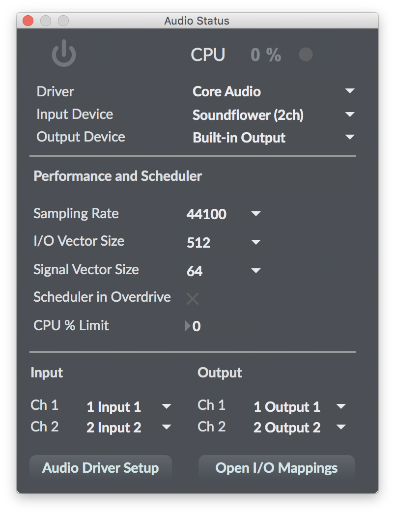

# vcv_max_msp

> Please note that these patches have only been tested on Mac OS X.

## Pre-requisites

For these patches to work, you will need the following softwares installed:

 - [VCV Rack (0.6+)](https://vcvrack.com/)
 - [Max/MSP (7+)](https://cycling74.com/downloads)
 - [Soundflower 2.0b2](https://github.com/mattingalls/Soundflower/releases/tag/2.0b2)

## Installing the patches

To install these patches, simply download and install them in the default library folder of Max/MSP. On mac OS X, it would typically be `~/Documents/Max\ 7/Library/`. Please check the 

> If Max is already started, it should usually pick up the new patches right away, but you may need to restart the application in some cases.

## Configuring Max/MSP's Audio Input Device

After installing Soundflower, you will need to make sure that it is setup as the active audio input device in Max/MSP. You can find these settings under `Options > Audio Status...`:

## Sending CV out of VCV Rack

Now, you can create a patch with some CV generator, and an audio interface. Set the audio interface output to `Soundflower (2ch)`. You can now send some CV out of VCV Rack by simply connecting the output to the audio interface, as shown below:

## Receiving and using CV data into Max/MSP

Finally, we can now create a Max/MSP patch that will make use of the CV data sent out of VCV Rack:
 - Create an `adc~` object,. and set the outputs to 1 & 2
 - send each output to a `twd_vcv_convert` object
 - the left outlet will output the frequency value, while the right outlet will output the corresponding midi note
 - from there, you can use `midiformat` and `midiout` to format and send the midi signal out to any other device

